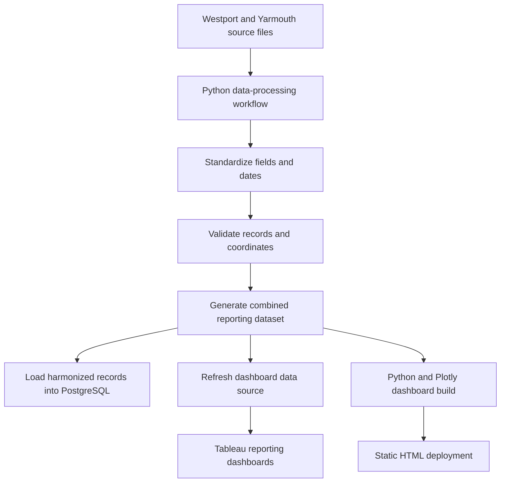

# Massachusetts Oyster Project - Data Infrastructure, Interactive Dashboards, and Shell Recycling Analytics

This repository contains the data-processing workflows and interactive dashboards developed for the Massachusetts Oyster Project (MOP) shell recycling program. The project consolidates collection records from participating restaurants, community events, and municipal partners into accessible tools for monitoring shell diversion, identifying participation trends, and communicating program impact.

The dashboards support:

- Public reporting and community outreach
- Grant applications and funder communications
- Restaurant and municipal partner engagement
- Weekly operational monitoring
- Geographic and temporal comparisons
- Reproducible, quality-controlled data updates

The repository includes two complementary dashboard systems:

1. An initial Python and Plotly dashboard designed for animated, public-facing exploration of program activity across Cape Cod.
2. Tableau dashboards developed for recurring operational reporting across Westport and Yarmouth, including town filters, weekly summaries, restaurant-level metrics, and mapped collection locations.

> **Project status:** Active development. Dashboard links, screenshots, and repository paths should be updated as new towns, reporting periods, and data sources are added.

---

## Contents

- [Project goals](#project-goals)
- [Dashboards](#dashboards)
  - [Python and Plotly public dashboard](#1-python-and-plotly-public-dashboard)
  - [Tableau operational dashboards](#2-tableau-operational-dashboards)
- [Automated data updates](#automated-data-updates)
- [Data processing and quality assurance](#data-processing-and-quality-assurance)
- [Technical architecture](#technical-architecture)
- [Repository structure](#repository-structure)
- [Running the project](#running-the-project)
- [Dashboard use](#dashboard-use)
- [Data privacy and publication](#data-privacy-and-publication)
- [Project impact](#project-impact)

---

## Project goals

Shell recycling data originated in separate files maintained for different towns, restaurants, events, and reporting periods. Differences in column names, date formats, location information, missing values, and reporting conventions made program-wide comparisons difficult and increased the amount of manual work required for recurring updates.

This project was developed to:

- Establish a consistent analytical dataset across participating communities
- Reduce repetitive data-cleaning and reporting work
- Preserve restaurant- and event-level detail while enabling program-wide summaries
- Make collection activity easier to explore through maps and interactive visualizations
- Improve the consistency and traceability of recurring reports
- Create reusable infrastructure that can accommodate additional towns and future collection records

---

## Dashboards

### 1. Python and Plotly public dashboard

The original dashboard is a self-contained, browser-based visualization generated programmatically in Python and rendered with Plotly.js.

**Live dashboard:** [Add deployed dashboard link]

**Source code:** [Add link to dashboard-generation script]

**Preview:**


#### Animated geospatial map

The left panel presents a year-by-year animation of restaurants with valid geocoded coordinates.

Features include:

- A Cape Cod-focused map extent
- Animated transitions between reporting years
- Persistent zoom and pan controls
- Restaurant-specific marker colors
- Hover information summarizing individual contributions
- Click-based map exploration
- Deterministic displacement of overlapping locations so that nearby markers remain visible and selectable

Event records without valid coordinates are excluded from spatial views but remain available in applicable aggregate and event summaries.

#### Data exploration modes

The right panel displays a bar chart that updates according to the selected view and geographic filters. The chart is generated from the same underlying dataset as the map.

##### Across Years

The **Across Years** view summarizes shell recycling over the full reporting period.

- Each bar represents the calculated shell-only weight for one year.
- Restaurant contributions appear as stacked segments.
- Regional selections recalculate annual totals using only the active geographic subset.
- The view provides a high-level picture of program growth and changes in participation.

##### By Restaurant

The **By Restaurant** view focuses on contributions from individual participating locations.

- Restaurant lists respond to the active regional selection.
- Users can compare participation among locations and across reporting periods.
- Restaurant labels and colors remain consistent across applicable views.

##### By Event

The **By Event** view summarizes non-restaurant shell collection activity.

- Events are reported independently of regional map filters when reliable coordinates are unavailable.
- Event contributions remain included in applicable program-wide totals.
- Separating events from restaurants prevents non-spatial records from being assigned misleading geographic locations.

#### Regional classification

The dashboard supports geographic comparison using predefined program regions:

- Mid-Cape
- Outer Cape

Restaurants with valid coordinates are assigned to regions using consistent geographic boundaries. Coordinate-based assignment was selected because it is deterministic and avoids inconsistencies caused by variations in addresses or municipal naming conventions.

Regional filters affect the dashboard as follows:

| View | Regional behavior |
|---|---|
| Across Years | Recalculates annual totals using restaurants in the selected region or regions |
| By Restaurant | Restricts the restaurant list and results to the active region or regions |
| By Event | Displays event summaries independently when events do not contain reliable coordinates |

#### Overlapping-location handling

Restaurants at the same or nearly the same location can otherwise appear as a single marker. The dashboard uses a small-distance clustering and displacement procedure to preserve access to individual records.

For each reporting year:

1. Restaurant coordinates are evaluated using an approximately 60-meter distance threshold.
2. Nearby locations are assigned to a common local cluster.
3. Locations within the cluster are positioned around a small radius from the cluster center.
4. Each location receives a consistent angular position.
5. A fixed random seed ensures that placement remains reproducible.

This approach keeps markers close to their recorded positions while making overlapping restaurants individually visible and clickable.

---

### 2. Tableau operational dashboards

The Tableau dashboards extend the initial public visualization into a recurring reporting system for municipal and nonprofit operations.

**Tableau Public:** [Add Tableau Public profile or dashboard link]

**Workbook:** [Add relative path or link to `.twb`/`.twbx` file]

**Preview:**


The combined dashboard currently supports reporting for:

- Westport
- Yarmouth

#### Dashboard features

- Town selection through a shared dashboard filter
- Weekly collection totals
- Restaurant-level comparisons
- Collection-location mapping using validated latitude and longitude coordinates
- Key performance indicators for collection activity
- Consistent tooltips containing restaurant, town, coordinates, and collection totals
- A shared data source that allows both towns to be analyzed in one workbook

The town selector enables staff to move between community-specific views without maintaining separate reporting systems. Filters are applied consistently across worksheets so that the map, summary metrics, and supporting charts describe the same subset of records.

#### Weekly reporting logic

Collection schedules do not always align cleanly with default calendar-week definitions. The Tableau workbook therefore uses defined reporting logic to assign collection dates to the appropriate operational week.

This was particularly important when reconciling records such as a June 12 collection assigned to one reporting week and a June 15 collection assigned to the following week. Explicit week-assignment logic prevents nearby dates from being grouped incorrectly and keeps town-level summaries consistent with operational reporting expectations.

#### Map construction

The Tableau map uses validated latitude and longitude fields rather than geocoding restaurant names during dashboard use.

This provides several advantages:

- Stable map placement across refreshes
- Fewer errors caused by ambiguous restaurant names or incomplete addresses
- Consistent coordinates across town-specific and combined views
- Easier identification and correction of missing or implausible locations during data preparation

---

## Automated data updates

The reporting workflow was designed to reduce the manual work required when new collection records are received.

### Update workflow



### Scheduled processing

A Windows Task Scheduler job runs the data-processing workflow on a recurring schedule. The scheduled process:

1. Reads the latest source files for each participating town.
2. Applies consistent column names and data types.
3. Standardizes collection dates, restaurant names, town labels, and numeric fields.
4. Combines the town-level datasets into a single reporting table.
5. Preserves or restores validated restaurant coordinates.
6. Checks for missing or malformed values.
7. Writes the refreshed combined dataset used for reporting.
8. Loads the harmonized records into PostgreSQL for structured storage and downstream analysis.

This automation reduces repetitive spreadsheet manipulation and ensures that each reporting cycle uses the same transformation and validation logic.

### Dashboard refresh boundaries

The data-preparation workflow is automated. Tableau publication behavior depends on how the workbook is connected and deployed:

- If Tableau reads the refreshed local reporting file, the workbook must refresh that data source before displaying new records.
- If a packaged workbook is published to Tableau Public, updated extracts may require the workbook to be refreshed and republished.
- The Python and Plotly dashboard is regenerated by rerunning the build script, which writes an updated `docs/index.html`; publishing then requires committing and pushing the generated file to GitHub Pages.

Documenting this boundary prevents the automated data pipeline from being confused with automatic publication of every dashboard artifact.

---

## Data processing and quality assurance

The workflow performs validation before records are used in maps, summaries, or database tables.

### Standardization

- Aligns source columns across towns
- Converts collection dates into consistent date values
- Standardizes restaurant and town labels
- Converts bucket, weight, latitude, and longitude fields to appropriate numeric types
- Replaces missing numeric collection values only when a zero represents the correct operational meaning
- Preserves source-level detail for traceability

### Shell-only weight calculation

Where required by the source data, shell-only weight is calculated by subtracting the estimated bucket weight from the recorded total weight. This keeps the reported metric focused on material diverted through shell recycling rather than container weight.

### Geographic validation

- Identifies records with missing coordinates
- Reuses validated coordinates for known restaurant locations
- Reviews coordinates that fall outside expected geographic bounds
- Prevents non-spatial event records from being displayed at invented map locations
- Maintains consistent coordinates for the same restaurant across reporting periods

### Temporal validation

- Reviews collection dates for missing or invalid values
- Applies explicit operational-week logic
- Checks year and week assignments before aggregation
- Prevents inconsistent default week definitions from changing reported totals

### Record-level review

- Checks required identifiers before database loading
- Reviews duplicates and repeated location records
- Verifies that town filters and location values agree
- Confirms that dashboard totals reconcile with the refreshed source dataset

---

## Technical architecture

### Python data layer

Python scripts are responsible for:

- Reading Excel and CSV source files
- Cleaning and transforming records
- Harmonizing multiple town datasets
- Validating coordinates and missing values
- Calculating derived reporting fields
- Producing the combined dashboard dataset
- Loading structured records into PostgreSQL
- Serializing data for the browser-based Plotly dashboard

### PostgreSQL layer

PostgreSQL provides a structured store for the harmonized collection data. It supports:

- Consistent field definitions
- Repeatable loading and querying
- Town- and restaurant-level filtering
- Future integration with additional reporting or analytical tools
- A clearer separation between raw source files and analysis-ready records

### Plotly and JavaScript layer

The public dashboard is generated as a self-contained HTML page. Embedded JavaScript controls:

- Map animation and the year slider
- View switching among year, restaurant, and event summaries
- Responsive bar-chart updates
- Dynamic legends
- Synchronization between active filters, map states, and chart values

The generated site is stored in `docs/index.html` for deployment through GitHub Pages.

### Tableau layer

Tableau provides the operational reporting interface, including:

- Shared filters
- Weekly performance summaries
- Interactive maps
- Key performance indicators
- Restaurant-level detail
- Town-level comparisons

---

## Repository structure

The exact filenames may vary as the project develops, but the repository should follow a structure similar to:

```text
massachusetts-oyster-project/
├── README.md
├── data/
│   ├── sample/
│   └── README.md
├── scripts/
│   ├── build_plotly_dashboard.py
│   ├── combine_town_data.py
│   └── load_to_postgres.py
├── tableau/
│   ├── shell_recycling_dashboard.twb
│   └── README.md
├── docs/
│   ├── index.html
│   └── images/
│       ├── plotly-dashboard-preview.png
│       └── tableau-dashboard-preview.png
├── documentation/
│   ├── data_dictionary.md
│   └── update_workflow.md
├── requirements.txt
└── .gitignore
```

Raw operational files, database credentials, and private extracts should not be committed to the public repository.

---

## Running the project

### Requirements

- Python 3.x
- Packages listed in `requirements.txt`
- Access to the approved source files
- PostgreSQL, if using the database-loading workflow
- Tableau Desktop or Tableau Public Edition, if editing the Tableau workbook

### Generate the combined dataset

```bash
python scripts/combine_town_data.py
```

### Load the harmonized data into PostgreSQL

```bash
python scripts/load_to_postgres.py
```

Database credentials should be supplied through environment variables or a local configuration file excluded by `.gitignore`. Credentials should never be stored directly in repository scripts.

### Rebuild the Python and Plotly dashboard

```bash
python scripts/build_plotly_dashboard.py
```

The build process generates or replaces:

```text
docs/index.html
```

Commit and push the updated HTML file to publish it through GitHub Pages.

> Update the example commands above to match the actual filenames used in this repository.

---

## Dashboard use

### Python and Plotly dashboard

#### Year slider

Controls the year-by-year view of shell recycling activity across the greater Cape Cod region.

#### Map

- Each marker represents a geocoded participating restaurant.
- Hovering displays a summary of the location's contribution.
- Clicking supports closer inspection of individual areas.
- Map controls allow users to zoom and pan.

#### Bar chart

- **Across Years:** displays annual shell-only weight with restaurant contributions shown as stacked segments.
- **By Restaurant:** compares participating restaurants within the selected region or regions.
- **By Event:** summarizes event-based contributions separately from spatial restaurant records.

### Tableau dashboards

#### Town filter

Select Westport or Yarmouth to update the associated metrics, charts, and map. Select all towns to review the combined program view.

#### Weekly summaries

Use the reporting-week view to compare collection activity over time. Operational week assignments are calculated consistently during data preparation and within the workbook logic.

#### Map

Each mark represents a participating collection location with validated coordinates. Tooltips provide location and collection details appropriate to the active dashboard view.

---

## Data privacy and publication

Before publishing repository files or Tableau workbooks:

- Confirm that the source data is approved for public release.
- Remove database credentials, connection strings, and local file paths.
- Review packaged Tableau workbooks because `.twbx` files may contain embedded extracts or source files.
- Use anonymized or synthetic sample data when operational records cannot be distributed.
- Exclude raw or private data directories through `.gitignore`.
- Review maps and tooltips for information that should not be publicly disclosed.

Recommended `.gitignore` entries include:

```gitignore
.env
*.env
credentials.json
config.ini
*.hyper
data/raw/
data/private/
exports/
__pycache__/
*.log
```

---

## Project impact

This project converts separate operational files into a repeatable reporting system. The resulting infrastructure enables Massachusetts Oyster Project staff to:

- Monitor shell collection activity across multiple communities
- Compare reporting periods, restaurants, towns, and regions
- Identify missing or inconsistent records before publication
- Reduce manual data preparation through scheduled processing
- Maintain consistent reporting definitions across dashboard updates
- Communicate program reach and shell diversion through accessible public-facing visualizations
- Extend the workflow as additional towns and collection partners join the program

The project demonstrates an end-to-end analytical workflow: clarifying reporting needs, integrating and validating data, developing metrics, automating recurring processing, building interactive dashboards, and communicating findings to technical and non-technical stakeholders.

---

## Maintainer

**Aidan Borkan**  
Data Analyst, Massachusetts Oyster Project  
[GitHub profile](https://github.com/aidanborkan)

